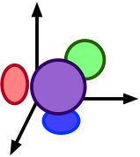

# #   ModelExploration.jl [](https://kris-brown.github.io/ModelExploration.jl/dev/)

Leveraging AlgebraicJulia to provide an interface for scientists to explore spaces of models.

## Basic idea

- We abstract the notion of a *model* and a *search space*. Our notion of a model is an instance of an `ACSet`
    - This is a very broad category of data structures
    - It is also restricted to 'concrete' things (representable by a relational database), which allows us to efficiently manipulate the models as data.

- The first key notion is that of a `Generator`: something that can generate a sequence of models.
   - 
   - There are many different ways we can imagine specifying this. E.g.:
       - One could literally give a finite sequence of precomputed models
           - 
       - One could write a function of type `ℕ ⟶ ACSet` that induces an infinite sequence
           - 
       - One could [enumerate](https://github.com/kris-brown/ModelEnumeration.jl) all possible models
       - One could specify some rewrite rules and initial model
    - Call these *primitive* `Generators`
- A *composite* `Generator` can be either "addition-like" (`AddLayer`) or "multiplication-like" (`MulLayer`).
    - Composite `Generators` depend on other `Generators`.
    - Thus, the overall model space is specified by a set of `Generators` (whose dependencies must form a *rooted* DAG: the root being the top-level model).
- An `AddLayer` is specified by an undirected wiring diagram (UWD).
   - 
   - UWDs have `Boxes`, `Junctions`, `Ports`, and `Wires`.[^1]
   - Each `Box` represents a placeholder for submodels to be filled in (by a `Generator`).
   - Each `Junction` is given by an `ACSet`.
       - This characterizes an overlap along which models are to be glued.
       - This is optional to specify. It defaults to the empty `ACSet`.
   - `Ports` live on `Boxes`. `Wires` connect `Junctions` and `Ports`
       - A `Wire` says that, given a model generated by the `Port`'s `Box`, it is to be glued to all other models connected to that `Junction`.
    - The model is glued together via a construction called a *pushout*
       - 
       - It requires a *homomorphism* from the `ACSet` of the `Junction` into the model that is generated by the `Box`.
            - If there are *multiple* homomorphisms possible, we pick one at random. [^2]
            - We'll allow constraints on each `Port` to help guide this selection process
                - Example: we're making models with data flowing on wires and through functions.
                - 
                - We want to glue two submodels along a wire, *head-to-tail*.
                - 

- A `MulLayer` is specified in terms of a set of dimensions, which are actually `Generators`.
   - This is in analogy to grid-search.
   - 
   - We explore the resulting product space (thought of as a DAG) via BFS from the base point. This works even when each dimension produces a DAG of models (rather than a linear sequence): the resulting product space still has a DAG structure. [^3]
   - Given a set of dimensions (i.e. `Generators`) and a choice for a model along each dimension, we construct a product model via *pullback*.
        - We need to interpret the models along each dimension as slices over a common base `ACSet` in order to take a pullback. This data is optional, as there is a sensible default (the terminal object).
        - Suppose we slice over a particular `A`. If there are multiple homomorphisms `X->A`, we pick one at random.
- Every `Generator` can be equipped with a `Loss` function, which evaluates the generated models against some criterion and possibly directs search in productive directions.
   - 
   - For example, imagine exploring a space of possible robots. There are three basic subtasks which are combined to get the desired functionality (e.g. moving objects from one side of the room to the other).
   - We have criteria for the subtasks independently of our overall criteria, so we use four different `Loss` functions simultaneously.
   - This will encourage submodels produced by the three nested `Generators` to be good at their tasks, while the top level `Loss` is directing search towards composite models where the three components work well *together* to solve the problem of moving objects.
   - A `Generator` can have a stopping criterion that halts the sequence of models based on the loss function.
       - Because models are getting more and more complex, we want to stop as soon as we get the functionality we need.
- We can further constrain the outputs of `Generators` either by mere `Filters` or by `Chase` constraints.

As an informal summary, the required data is, as an algebraic data type:
```
SearchSpace := {schema :: ACSetSchema,  gens :: [Generator]}

Generator := {name   :: Symbol,
              gen    :: Gen,
              constr :: [Constraint],
              loss   :: Maybe LossFn}

Gen := PrimitiveGen | CompositeGen

PrimitiveGen := ExplicitPreorder | RewriteRules
                | FreeGeneration | FunctionGenerated
                | etc.

CompositeGen := AddLayer | MulLayer

AddLayer := {pattern :: UWD}

UWD := {boxes :: [Box], ports :: [Port],
        junctions :: [Junction], wires :: [Wire]}
  Box      := {gen_id :: Symbol}
  Port     := {box_id :: Int, constraint :: [InterfaceConstraint]}
  Junction := {overlap :: Maybe ACSet}
  Wire     := {junc_id :: Int, port_id :: Int}

MulLayer   := {dim_gen_ids :: [Symbol], slice :: Maybe ACSet}

LossFn     := {fn :: RealValuedFunction, stop :: Maybe StopCriteria}
Constraint := Filter | Chase
```

This might seem overwhelming, but the full complexity is not needed in every case. An epidemiology model might be well generated from just one `MulLayer` containing three primitive `Dimensions`, and a circuit might be generated well from one `AddLayer`. It's likely not needed to have constraints on layers or to constrain the interfaces used in `AddLayers`.

[^1]: Normally UWDs also have 'outer ports', which allow you to know ahead of time what `Boxes` the result can be plugged into. However, for us, checking whether a particular submodel fits into a `Box` with a particular interface is something done at 'run-time' rather than 'compile-time', as it were. More details will come below.

[^2]: We really want there to be *some* homomorphism, so we filter the output produced by the `Generator` to those which satisfy the interface.

[^3]: We also could (but don't yet) give distances to the edges of the preorder and get a *metric space*. Now the analogy of 'radiating outward from the origin' becomes more literal.

## Open questions
- We *explicitly* provided the composition structure for `AddLayers`. It's nice we can do this, but is there a sensible way to have a controlled exploration of the space of UWDs? (hard part: this space includes the junction overlap `ACSets` and the `Generators` that fill the nested boxes)
- We have a hierarchical structure but *explicitly* provide the hierarchy. It's nice we can do this, but is there a sensible way to have a controlled exploration of this space of rooted DAGs of `Generators`?
- We ought to be have the option to perform *gradient descent* in the induced model space. Ironing out the details of this conceptually will be important.

## Three Examples

### Optimal boolean circuits
Given truth table find shortest formula. We have strict stopping criteria.

### Epidemiology models
Given experimental data, we want to find the model that best explains it.

Our model space is Petri Nets that have up to two inputs and two outputs.


### Neural architecture search
Given a dataset of `n` features, we want to learn a function `ℝⁿ ⟶ ℝ` that fits the data without overfitting it. Fixing the method of training the model, the free parameter that decides what our function will be is the architecture of the network. The model space has networks with `n` inputs and one output.


### (Optional) Resistor networks
Oscilloscope data + graphs of resistors. Kind of a combination of the first two.


